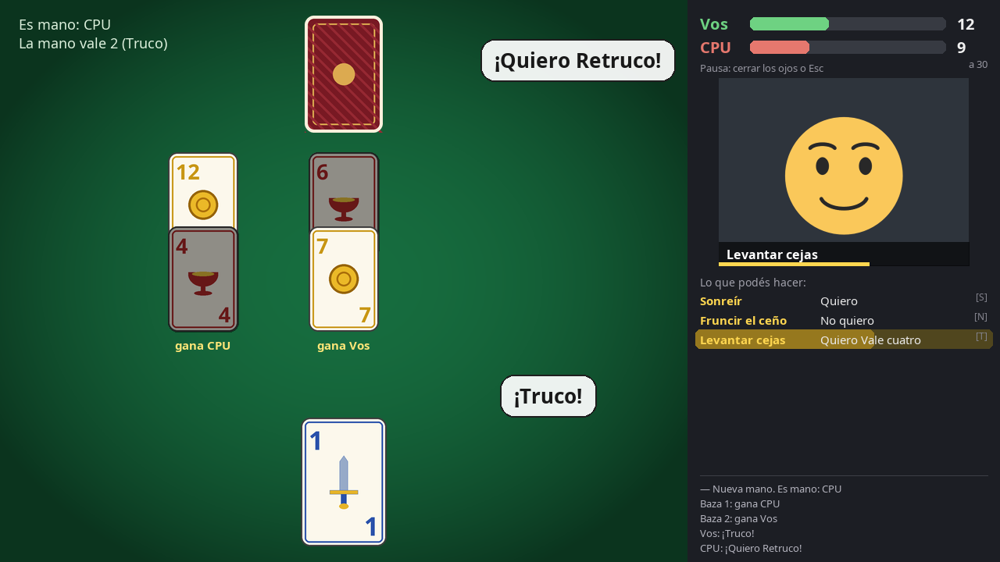
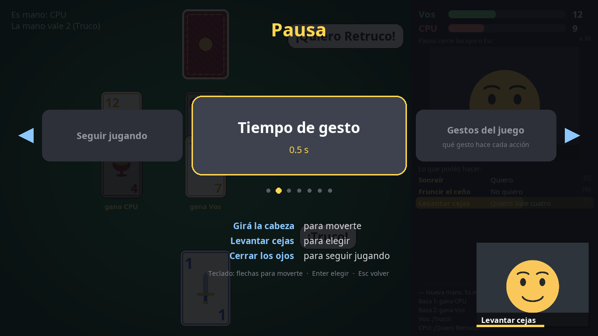

# Truco con la cara

Un truco argentino que se juega **con gestos de la cara**: levantás las cejas para cantar truco, hacés trompita para el envido, sonreís para decir "quiero" y abrís la boca para tirar la carta. Todo con una webcam común, y **se puede usar entero sin manos**: desde la calibración hasta salir del juego.



## Cómo se juega

Es un truco 1 contra 1 contra la compu, a 15 o 30 puntos, sin flor. Para que un gesto cuente hay que sostenerlo medio segundo (se puede cambiar), y una barrita muestra cuánto falta.

| Gesto | Acción (por defecto) |
|---|---|
| Girar la cabeza a izquierda o derecha | Elegir carta |
| Abrir la boca | Tirar la carta elegida |
| Levantar las cejas | Truco / Retruco / Vale cuatro |
| Trompita (beso) | Envido |
| Guiño izquierdo | Real envido |
| Guiño derecho | Falta envido |
| Sonreír | Quiero |
| Fruncir el ceño | No quiero |
| Inflar los cachetes | Irse al mazo |
| Cerrar los ojos | Menú de pausa |

También están **levantar solo la ceja izquierda** y **solo la derecha**, para asignarlas a lo que quieras. El panel de la derecha muestra en cada momento solo lo que podés hacer.

**Menú de pausa** (se abre cerrando los ojos): girás la cabeza para moverte, levantás las cejas para elegir y volvés cerrando los ojos. Ahí podés cambiar el tiempo de gesto, qué gesto hace cada acción y el largo del partido, o recalibrar.



Si preferís, todo se puede hacer con el teclado: flechas, espacio, `T` truco, `E` envido, `R` real envido, `F` falta envido, `S` quiero, `N` no quiero, `M` mazo, `Esc` pausa, `Q` salir.

### La primera vez: calibración

Cada cara es distinta, así que la primera vez el juego aprende **tus** gestos: te pide cada uno durante unos 2 segundos (alrededor de un minuto en total). Para empezar, abrí la boca bien grande hasta llenar la barra.

Al terminar aparece **"¡Calibración lista!"**, donde podés ir a jugar, probar tus gestos en vivo o recalibrar alguno (empieza por el que peor te reconoce). Lo mismo está en la pausa, en **"Tus gestos"**. De la prueba en vivo se vuelve cerrando los ojos 2 segundos.

### Perfiles: para mostrárselo a alguien

Cada calibración es un **perfil**. Si querés que otra persona juegue con sus propios gestos: pausa → **Tus gestos** → **Calibrar a otra persona**. Esa persona arranca su calibración abriendo la boca y se crea el "Perfil 2" (los nombres son automáticos, porque sin manos no se puede escribir). Con **Elegir perfil** se vuelve al tuyo o se borra el que ya no se use. El juego recuerda el último perfil usado.

Para manejar el menú, con la calibración de cualquiera suele andar bien (girar la cabeza, levantar las cejas y cerrar los ojos son gestos fáciles de reconocer); el perfil propio hace falta para el ajuste fino de la partida.

## Descargar y jugar

Bajá el paquete de tu sistema desde [Releases](../../releases/latest).

**Windows:** descomprimí `truco-con-la-cara-windows-x64.zip` y abrí `truco-con-la-cara.exe` adentro de la carpeta. Como el ejecutable no está firmado, Windows puede mostrar "Windows protegió su PC": tocá **Más información → Ejecutar de todas formas**.

**Linux:**
```bash
tar -xzf truco-con-la-cara-linux-x86_64.tar.gz
./truco-con-la-cara/truco-con-la-cara
```

En Linux hace falta `libEGL`, que en cualquier escritorio ya viene instalada (si no: `sudo apt install libegl1` o `sudo dnf install libglvnd-egl`).

La primera vez tarda unos segundos en abrir. Si algo no anda, correlo con `--diagnostico`: revisa la cámara, el modelo y las fuentes sin abrir el juego. Si tenés más de una cámara, elegí otra con `--camara 1`.

## Correrlo desde el código

```bash
git clone <este repo>
cd truco-con-la-cara
python3 -m venv .venv
.venv/bin/pip install -r requirements.txt
.venv/bin/python juego.py
```

Para armar el ejecutable: `.venv/bin/pip install pyinstaller` y `.venv/bin/python build.py` (deja el paquete en `dist/`). Los ejecutables de cada versión los arma GitHub Actions para Linux y Windows (`.github/workflows/ejecutables.yml`).

Probado en Fedora 44 con Python 3.14 y una Logitech Brio 100.

## Cómo funciona

- **Detección de la cara:** [MediaPipe Face Landmarker](https://ai.google.dev/edge/mediapipe/solutions/vision/face_landmarker) da, en cada cuadro, 52 valores ("blendshapes") que dicen cuánto está haciendo la cara cada movimiento: sonrisa, mandíbula abierta, cejas, ojos…
- **Reconocimiento personalizado:** en vez de umbrales fijos (que andaban mal: un guiño también te sube las cejas, al inflar los cachetes se te frunce la boca), el juego graba tus gestos y los reconoce con *k* vecinos más cercanos sobre esos valores. No usa hacia dónde mirás, porque eso cambia cuando recorrés la pantalla con la vista.
- **Filtro en el tiempo:** un gesto se dispara si estuvo presente al menos ~2/3 del tiempo de espera. Así tolera algún cuadro perdido, pero no se dispara por gestos sueltos mientras hablás o te reís.
- **Girar la cabeza:** se mide dónde queda la nariz respecto del centro de la cara.
- **La compu:** para decidir si canta truco o quiere, simula cientos de manos posibles con las cartas que no vio (Monte Carlo). A veces miente con el envido.
- **Reglas:** envido, real envido y falta envido; truco, retruco y vale cuatro; "el envido está primero"; pardas como en el truco de verdad.

## Privacidad

Todo corre en tu compu: la imagen de la cámara no se guarda ni se manda a ningún lado. Los perfiles guardan solo los números de los gestos (no imágenes) en `~/.config/truco-con-la-cara/perfiles/` (en Windows, `%APPDATA%\truco-con-la-cara\perfiles\`).

## Archivos

| Archivo | Qué hace |
|---|---|
| `juego.py` | Programa principal: mesa, pantallas y bucle del juego |
| `truco.py` | Reglas del truco y la compu |
| `caras.py` | Cámara, reconocimiento de gestos, calibración y control |
| `menu.py` | Menú de pausa manejado con la cara |
| `ajustes.py` | Ajustes guardados (tiempo, puntos, gesto de cada acción, perfil en uso) |
| `perfiles.py` | Perfiles: una calibración por persona |
| `dibujo.py`, `rutas.py` | Utilidades de dibujo y de rutas de archivos |
| `build.py` | Arma el ejecutable con PyInstaller |
| `gestos.py` | Demo suelta: muestra en vivo qué gestos detecta |

## Créditos y licencias

- Código: [MIT](LICENSE), por Facundo Lorente.
- Modelo `face_landmarker.task`: [MediaPipe](https://github.com/google-ai-edge/mediapipe) de Google, licencia Apache 2.0.
- Fuente Noto Sans: licencia [SIL Open Font License 1.1](fuentes/OFL.txt).
